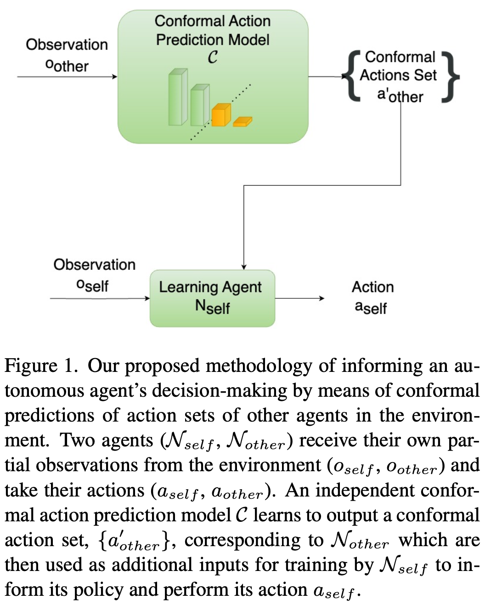

# CAMMARL 

**Paper**: CAMMARL: Conformal Action Modeling in Multi Agent Reinforcement Learning [[ArXiv](https://arxiv.org/abs/2306.11128)] <br />
**Authors**: Nikunj Gupta and Samira Ebrahimi Kahou <br />
**Affiliations**: Mila Quebec AI Institute,  ETS Montreal, New York University, CIFAR AI Chair <br />
**Correspondence**: nikunj.gupta@nyu.edu 

<!-- Cite this paper as: 

```
``` -->

# Abstract 

Before taking actions in an environment with more than one intelligent agent, an autonomous agent may benefit from reasoning about the other agents and utilizing a notion of a guarantee or confidence about the behavior of the system. In this article, we propose a novel multi-agent reinforcement learning (MARL) algorithm CAMMARL, which involves modeling the actions of other agents in different situations in the form of confident sets, i.e., sets containing their true actions with a high probability. We then use these estimates to inform an agent’s decision-making. For estimating such sets, we use the concept of conformal predictions, by means of which, we not only obtain an estimate of the most probable outcome but get to quantify the operable uncertainty as well. For instance, we can predict a set that provably covers the true predictions with high probabilities (e.g., 95%). Through several experiments in two fully cooperative multi-agent tasks, we show that CAMMARL elevates the capabilities of an autonomous agent in MARL by modeling conformal prediction sets over the behavior of other agents in the environment and utilizing such estimates to enhance its policy learning. 

<!--  -->

<p align="center"></p>


# Running Experiments 

### Installation 

```pip install -r req.txt``` 

### Experiments 

`cam-cn` or `cam-lbf` folders contain scripts to run all the CAMMARL versions (`cp-padded`, `cp-binary`, `cp-penultimate`) and EAP (as discussed in paper). `baselines` folder has all the baselines/benchmark experiments as discussed in the paper (GIAM / NOAM / TAAM / TOAM). 

For example, 

```python cam-cn/cp-padded.py [OPTIONS]``` 

Available options: 

- `--env`: "cn" (see next section on Environments). This options allows using the scripts for other MPE environemts too. For lbf, use scripts in `cam-lbf` folder. 
- `--max_episodes`: total number of episodes to run the experiments. 
- `--cp_update_timestep`: number of timesteps after which you want to update the conformal prediction model. 
- `--seed`: to set unique seed for an experiment. 
- `--log_dir`: to set the directory to save experiment logs. 

# Environments 

- [Cooperative Navigation (CN)](https://pettingzoo.farama.org/environments/mpe/simple_spread/): 

The MPE environments were originally described in the following work:

```
@article{mordatch2017emergence,
  title={Emergence of Grounded Compositional Language in Multi-Agent Populations},
  author={Mordatch, Igor and Abbeel, Pieter},
  journal={arXiv preprint arXiv:1703.04908},
  year={2017}
}
```

But were first released as a part of this work:

```
@article{lowe2017multi,
  title={Multi-Agent Actor-Critic for Mixed Cooperative-Competitive Environments},
  author={Lowe, Ryan and Wu, Yi and Tamar, Aviv and Harb, Jean and Abbeel, Pieter and Mordatch, Igor},
  journal={Neural Information Processing Systems (NIPS)},
  year={2017}
}
```

PettingZoo's implementation of OpenAI's Multi-agent Particle environments: 

```
@article{terry2021pettingzoo,
  title={Pettingzoo: Gym for multi-agent reinforcement learning},
  author={Terry, J and Black, Benjamin and Grammel, Nathaniel and Jayakumar, Mario and Hari, Ananth and Sullivan, Ryan and Santos, Luis S and Dieffendahl, Clemens and Horsch, Caroline and Perez-Vicente, Rodrigo and others},
  journal={Advances in Neural Information Processing Systems},
  volume={34},
  pages={15032--15043},
  year={2021}
}
```


- [Level-based Foraging (LBF)](https://github.com/semitable/lb-foraging): 

The paper that first uses this implementation of Level-based Foraging (LBF) and achieves state-of-the-art results:
```
@inproceedings{christianos2020shared,
  title={Shared Experience Actor-Critic for Multi-Agent Reinforcement Learning},
  author={Christianos, Filippos and Schäfer, Lukas and Albrecht, Stefano V},
  booktitle = {Advances in Neural Information Processing Systems (NeurIPS)},
  year={2020}
}
```

A comperative evaluation of cooperative MARL algorithms and includes an introduction to this environment:

```
@inproceedings{papoudakis2021benchmarking,
   title={Benchmarking Multi-Agent Deep Reinforcement Learning Algorithms in Cooperative Tasks},
   author={Georgios Papoudakis and Filippos Christianos and Lukas Schäfer and Stefano V. Albrecht},
   booktitle = {Proceedings of the Neural Information Processing Systems Track on Datasets and Benchmarks (NeurIPS)},
   year={2021},
   openreview = {https://openreview.net/forum?id=cIrPX-Sn5n},
}
```


# Appendix   
### Steps for Multiagent ALE Atari 
#### On Local 
Step 1: Install the following: 
```
multi-agent-ale-py
autorom[accept-rom-license]
atari-py
```
Note: Also install `cmake` if not already installed. 

Step 2: Download roms 
```
AutoRom --install-dir <path>
```

Step 3: Import Roms 
```
python -m atari_py.import_roms <path-to-roms> 
```

Good to go! 

#### On Compute canada 
Use AutoROM wheel available in compute canada 
```
avail_wheels autorom

pip install AutoROM==0.1.19 

AutoROM --install-dir <path/to/install/roms>

AutoROM --accept-license 

```

More information: 

Note: If `AutoROM --install-dir <path/to/install/roms>` does not work on compute canada, use trick --> copy roms from local using Globus. 

#### Code references 
- [Conformal-Classification](https://github.com/aangelopoulos/conformal_classification) 
- [Level-Based Foraging](https://github.com/semitable/lb-foraging)
- [PettingZoo's implementation of OpenAI MPE environments](https://pettingzoo.farama.org/environments/mpe/simple_spread/) 
- [PPO-Pytorch](https://github.com/nikhilbarhate99/PPO-PyTorch) 


## Cite 
```
@article{gupta2023cammarl,
  title={CAMMARL: Conformal Action Modeling in Multi Agent Reinforcement Learning},
  author={Gupta, Nikunj and Kahou, Samira Ebrahimi},
  journal={arXiv preprint arXiv:2306.11128},
  year={2023}
}
```
